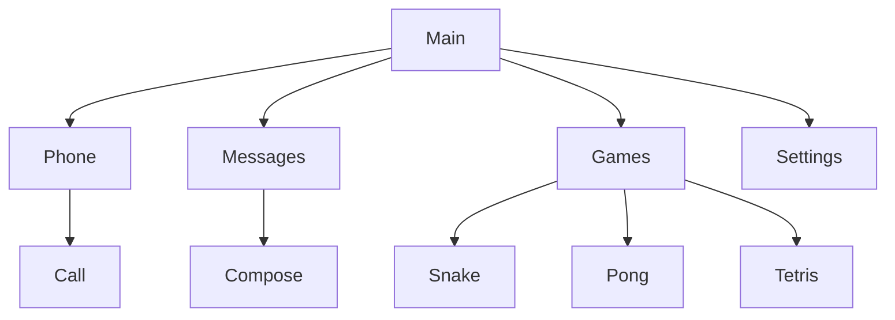

# UI Flow Spec — ESP Phone

Fill this in, then ask: **“Implement the UI from `UI_FLOW.md`.”**  
Use one block per screen. Skip games detail if defaults are fine.

**Legend**
- `→ ScreenName` = navigate there
- `[Confirm]` `[Bksp]` `[↑↓←→]` `[CALL]` `[END]` `[Shift]` = hardware keys
- Focusable items are listed top→bottom (arrow order)

---

## Global chrome (every screen)

| Element | Behavior |
|---------|----------|
| Status bar | Shows: … |
| `[Bksp]` | Usually: go back / delete text (specify per screen if different) |
| `[END]` | Always hang up if in call? Y/N |

---

## Screen: MainMenu

**Purpose:**  

**Layout (top → bottom):**
1. 
2. 
3. 

**Focusables (arrow order):**
1. → 
2. → 

**Keys:**
| Key | Action |
|-----|--------|
| `[Confirm]` | Activate focused item |
| `[Bksp]` | (none / stay) |
| Other | |

**Notes / sketch:**
```
(optional ASCII wireframe)

┌────────────────────────┐
│                        │
└────────────────────────┘
```

---

## Screen: Phone / Dialer

**Purpose:**  

**Layout:**
1. 
2. 

**Focusables:**
1. 
2. 

**Keys:**
| Key | Action |
|-----|--------|
| letter / `[Shift]`+letter | |
| `[Confirm]` / `[CALL]` | |
| `[Bksp]` | |
| `[END]` | |

**On successful dial →**  

---

## Screen: Call

**Purpose:**  

**States to show differently:**
- Dialing: 
- Ringing (incoming): 
- In call: 
- Ended: 

**Focusables:**
1. 
2. 

**Keys:**
| Key | Action |
|-----|--------|
| `[Confirm]` | Answer if ringing? |
| `[END]` | |
| digits | DTMF? Y/N |

---

## Screen: Messages (inbox)

**Purpose:**  

**Layout:**
1. 
2. 

**Focusables:**
1. 
2. 

**Keys:**
| Key | Action |
|-----|--------|
| `[Confirm]` | |
| `[Bksp]` | |

---

## Screen: Compose SMS

**Purpose:**  

**Fields / order:**
1. To: 
2. Body: 

**Keys:**
| Key | Action |
|-----|--------|
| `[Confirm]` | |
| `[Bksp]` | |
| `[Shift]` | |

**On send success →**  

---

## Screen: Games menu

**Focusables:**
1. Snake → 
2. Pong → 
3. Tetris → 
4. Back → 

---

## Screen: Settings

**What to show:**
- 

**Focusables / actions:**
1. 
2. 

---

## Navigation map (optional)

Paste a mermaid flowchart if you like:



---

## Design preferences (optional)

- Dark / light:
- Accent color (hex):
- Font size priority (big dial digits? etc.):
- Anything to **avoid**:

---

## Out of scope for this pass

List features to skip for now:
- 
